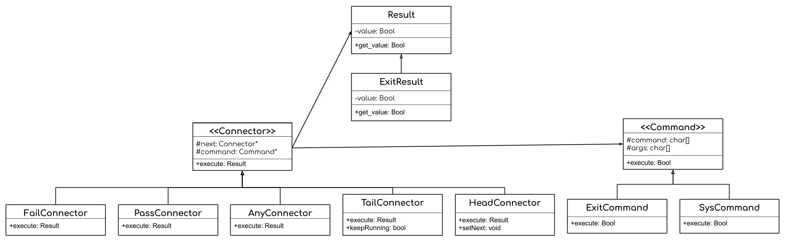

# CS 100 Programming Project
> ### Spring 2019
> ### Malhar Nerurkar (862004989) Arian Alavi (862030914)

# Introduction
Our program will consist of a command shell that
will be able to read in bash commands, typically located within PATH directories, and execute them using the fork, execvp, and waitpid syscalls. We will be using the composite pattern for our program. 

**ADD DESCRIPTION OF HOW INPUTS ARE PROCESSED HERE
# Diagrams

# Classes

# Prototypes/Research
* **waitpid():** Used to pause the calling process until the appropriate system information about a child process is received. More specifically, it waits until the child process has ended or been terminated. The *pid* value determines which child process the system should wait for.

* **execvp():** Searchs a path for a desired program to execute. If a match is found, the program is loaded into memory, effectively replacing the current running program.
    * The name of the program that we are searching for
    * Its arguments (in the form of a null-terminated array of character pointers)
* **fork():** Creates a new child process that runs alongside the parent process. The fork() call returns an integer: 
    * ***Negative value***: represents parent process; indicates that the child process was not created successfully
    * ***Zero***: represents the child process
    * ***Positive Value***: represents the parent process

    The total number of processes is equal to 2n where n = # of fork() syscalls.

## ***waitpid()*, *execvp()*, and *fork()* can also be used concurrently:**
* ***execvp()*** : used to run a program (a bash command in our case)

* ***fork()*** : used to continue the program after the first process has been terminated (and to allow for additional processes)
* ***waitpid()*** :  used to ensure that the processes run one-by-one by waiting until the child process has ended before calling the parent process 

**see prototypes for example of this*

## **Connectors:**
**We will be implementing three connectors to separate processes (commands) in our program:**
*  " ; " : will be used to separate multiple processes which be then execute in the given order

* " && " : will be used to run a subsequent process only if the process before it was successful

* " | | " : will be used to run a subsequent process only if the process before it was unsuccessful 

# Development and Testing Roadmap

